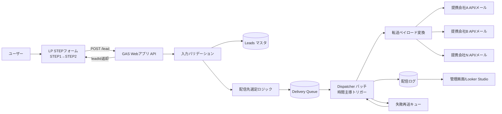
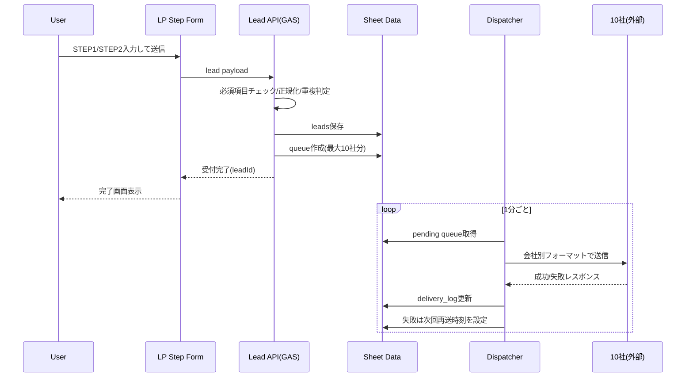

# STEPフォーム向けバックエンド設計図（Googleフォーム不使用）

作成日: 2026-03-12  
対象LP: `docs/client_materials/mockups/2026-03-08_kei-mb_lp-design-mock-v4-rebuild.html`

## 1. 結論

- Googleフォームは使わず、LP内STEPフォームからAPIへ直接POSTする構成を推奨。
- 送信は「即時レスポンス」と「10社転送の非同期実行」を分離する。
- 初期実装は Google Apps Script（Webアプリ）+ Googleスプレッドシートで十分運用可能。

## 2. 全体構成図

## 3. 送信シーケンス図

## 4. データ設計（スプレッドシート）

### `leads`

- `lead_id` (UUID)
- `created_at`
- `status` (`accepted` / `queued` / `completed` / `partial_failed`)
- `move_timing`
- `from_zip`
- `to_zip`
- `people_count`
- `name`
- `phone`
- `email`
- `from_address`
- `to_address`
- `move_date_note`
- `building_type`
- `request_note`
- `consent_flag`
- `source` (`lp_v4`)

### `partners_master`

- `partner_id`
- `partner_code`（例: `ESPACE`）
- `partner_name`
- `active_flag`
- `area_rules`（都道府県/郵便番号帯）
- `capacity_daily`
- `priority`
- `endpoint_type` (`api` / `email`)
- `endpoint_url_or_mail`
- `auth_info`
- `proof_url`（会社情報URL）

### `area_routing_rules`

- `pref_code`（`OSAKA` / `HYOGO` / `KYOTO` など）
- `route_mode`（`broadcast` / `single`）
- `single_partner_id`（`route_mode=single` の場合のみ）
- `max_targets`（通常 `10`）
- `fallback_partner_id`（未対応時の集約先）
- `notes`

### `delivery_queue`

- `queue_id`
- `lead_id`
- `partner_id`
- `attempt_count`
- `next_retry_at`
- `queue_status` (`pending` / `sending` / `success` / `failed` / `dead`)

### `delivery_log`

- `log_id`
- `queue_id`
- `sent_at`
- `result` (`success` / `failed`)
- `http_status`
- `response_summary`
- `payload_hash`

## 5. 配信ロジック（10社選定）

1. `from_zip` / `to_zip` から都道府県コードを解決  
2. `area_routing_rules` から `pref_code` のルールを取得  
3. 対応会社（`partners_master.active_flag=true` かつ `area_rules` 一致）を抽出  
4. 対応会社が0件なら `fallback_partner_id`（クライアント宛）へ1件だけキュー作成  
5. 対応会社が複数件のとき:
   - `route_mode=broadcast`: 最大 `max_targets` 件へ一斉転送
   - `route_mode=single`: `single_partner_id` 1社のみに固定転送
6. 送信先確定後、`delivery_queue` を作成して非同期転送

## 5.1 クライアント確定ルール（今回反映）

1. 対応エリア（都道府県）で振り分け  
2. 対応不可エリアはクライアント宛に集約  
3. 複数社対応エリアは「一斉転送」または「優先順位1社固定」をエリア単位で選択

### ルール初期値（暫定）

| pref_code | route_mode | single_partner_id | fallback_partner_id |
| --- | --- | --- | --- |
| OSAKA | broadcast |  | CLIENT_AGGREGATE |
| HYOGO | broadcast |  | CLIENT_AGGREGATE |
| KYOTO | broadcast |  | CLIENT_AGGREGATE |
| OTHER | single | CLIENT_AGGREGATE | CLIENT_AGGREGATE |

## 6. Googleフォームを使わない理由

- STEP UI/UX（入力途中保存、分割バリデーション、進捗表示）を柔軟に制御できる
- 会社ごとの配信形式差分に対応しやすい
- 転送キュー、再送、監査ログを同一バックエンドで管理できる

## 7. 実装フェーズ（最短）

1. LPのSTEPフォーム送信先を `GAS Webアプリ` に変更  
2. `leads` 保存APIを先に完成（同期応答のみ）  
3. `delivery_queue` 作成まで追加  
4. Dispatcherバッチ（1分間隔）で10社転送を非同期化  
5. 再送ルール（例: 3回、5分/30分/2時間）と失敗通知を追加

## 8. 運用ルール（最低限）

- 個人情報保持期間を決める（例: 90日）
- 送信同意チェック必須（利用規約/プライバシーポリシー同意）
- 会社側障害時に「一時停止」できる `active_flag` を運用で管理
- 毎日1回、`dead` 件数を確認

## 9. 提携業者マスタ初期登録（暫定）

| partner_code | partner_name | area_rules | proof_url |
| --- | --- | --- | --- |
| ESPACE | 株式会社エスパス（Espace） | OSAKA | https://espace-osaka.com/company/ |
| AVAIL | 株式会社アベイル（Avail） | OSAKA | https://fuyouhinkaisyuu-avail.com/about/ |
| BLEX | 株式会社ブレックス（BLEX） | HYOGO | https://www.blex.co.jp/information/ |
| RMOVE | R.move（アールムーブ） | HYOGO | https://www.rmove.jp/company.html |
| GFT | 株式会社GFT | KYOTO | https://gft-kyoto.com/ |
| D_ENTERPRISE | 株式会社Dエンタープライズ（ダイちゃんの引越サービス） | HYOGO | https://d-hikkoshi.com/company.html |
| SAKAI | サカイ引越センター（法人営業） | ALL | https://www.hikkoshi-sakai.co.jp/index.html |
| U_ASSIST | 株式会社U-ASSIST（引越ASSIST） | OSAKA | https://www.u-assist.biz/company-profile |
| FINE | 株式会社ファイン（ファイン引越サービス） | OSAKA | https://www.fine-moving.co.jp/company/ |
| AI1254 | 愛の引越サービス | OSAKA | https://www.ai1254.com/ |

補足:
- `CLIENT_AGGREGATE` は提携業者ではなく、未対応エリア受け皿用の内部宛先ID。
- `SAKAI(ALL)` は将来、未対応エリアのフォールバック候補として使えるよう保持。
