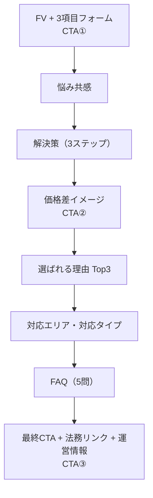

# Kei mb様 ワイヤーフレーム初稿 1枚スライド（説明原稿付き v1）

作成日: 2026-03-05  
用途: クライアント打ち合わせでのGate5承認取得

## スライド掲載文（そのまま使用可）

**タイトル**  
LPワイヤーフレーム初稿（CV優先・8セクション）

**サブタイトル**  
参考LPの即入力導線を維持し、実装再現性を担保した最短構成

**左カラム（要点）**
- 目的: フォーム送信CVを最短距離で獲得
- 固定条件: 1ページ / 最大8セクション / スマホ最適化
- CTA配置: FV・中盤・最下部の3点（同一デザインで統一）
- 今回決定: 構成順とCTAタイミングを確定し、文言は次工程で最終化

**右カラム（導線図）**

**フッター（合意事項）**
本日確認: 1) セクション順 2) CTA統一方針 3) FAQ5問運用

## 45秒説明原稿（読み上げ用）

「本初稿は、フォーム送信CVを最短で獲得するために、全体を8セクションへ圧縮した構成です。  
ポイントは、FVで3項目だけ先に入力できる導線を維持しつつ、中盤で比較価値を提示して再度CTA、最後にFAQ解消後の最終CTAへつなぐ流れです。  
本日は、セクション順とCTAをこのタイミングで確定し、文言の細部は次工程で詰める進め方をご提案します。」

## クロージング質問（その場で使う1文）

「この8セクション順とCTA配置で制作着手して問題ないでしょうか。」
