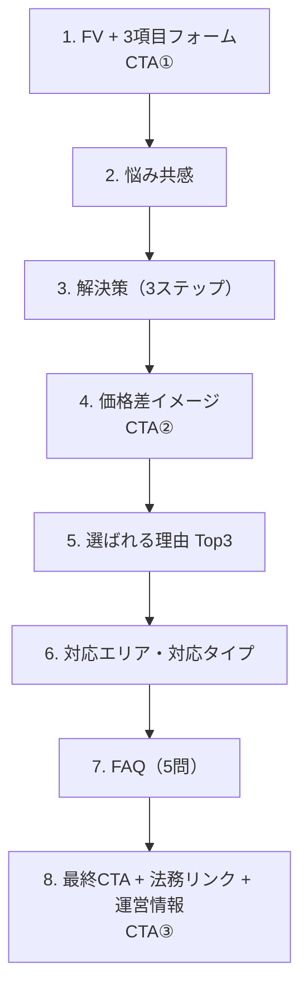

# Kei mb様 LPワイヤーフレーム初稿（テキスト+可視化セット v1）

作成日: 2026-03-05  
用途: クライアント初稿提示（Gate5: ワイヤー構成承認）

## 1. テキスト版（8セクション構成）

| # | セクション名 | 役割 | CTA |
| --- | --- | --- | --- |
| 1 | FV + トップフォーム（3項目） | スクロール前に入力開始し、離脱を最小化 | CTA①（一次CV） |
| 2 | 悩み共感（電話ラッシュ/比較負荷） | ターゲットの課題を言語化し自分ごと化 | なし |
| 3 | 解決策（3ステップ） | 送信後フローを明示して不安を減らす | なし |
| 4 | 価格差イメージ（例示+注記） | 比較する価値を直感的に理解させる | CTA②（中間CV） |
| 5 | 選ばれる理由 Top3 | 価格以外の判断材料を補強する | なし |
| 6 | 対応エリア・対応タイプ | 対象可否を即判断させる | なし |
| 7 | FAQ（5問） | 送信前の疑問を解消し障壁を下げる | なし |
| 8 | 最終CTA + 法務リンク + 運営情報 | 行動喚起と信頼担保を同時に行う | CTA③（最終CV） |

## 2. 可視化版（ページ導線図）

## 3. クライアント確認ポイント（その場で意思決定）

1. セクション順はこのままで進行して問題ないか。
2. CTAは「同一文言・同一デザイン」で固定してよいか。
3. FAQは5問で確定し、詳細文は次工程（Gate6）で調整してよいか。

## 4. 説明用ワンフレーズ

「参考LPの強みである“即入力導線”を維持しつつ、最大8セクションの契約条件でCV効率を優先した再現性の高い構成です。」
